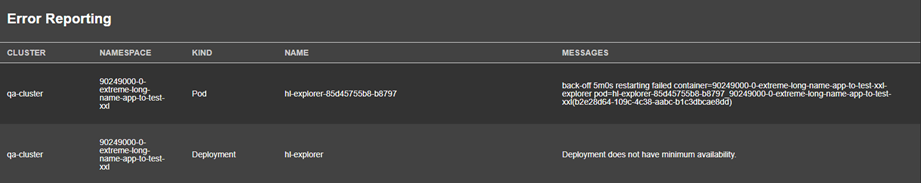
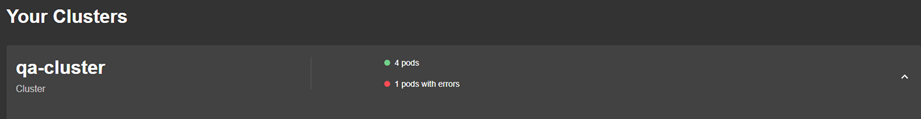
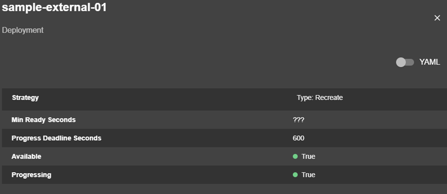
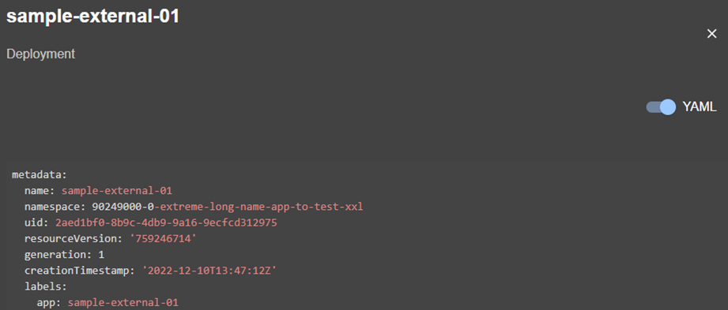
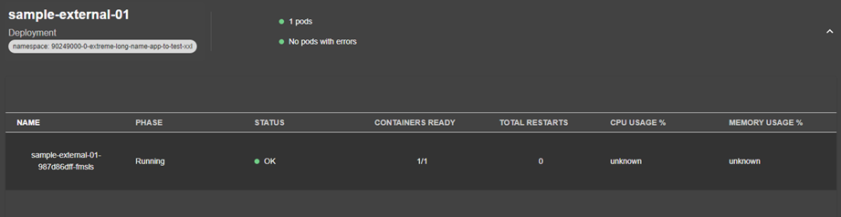

## Estado de Servicios

Permite ver el estado los servicios que componen las Dapps que se estén ejecutando en nuestra plataforma.

### Reporte de Errores

Muestra un reporte de los errores donde se puede identificar los servicios que estén presentando algún problema en su ejecución. 

### Resumen de Estado de los Servicios

Muestra un resumen de estado de todos los servicios de las Dapps desplegadas. 

### Propiedades de los Servicios

Para cada servicio es posible ver sus propiedades y estado tanto en formato gráfico como en formato YAML

### Estructura y Estados de los Servicios

Se pueden expandir los paneles para desvelar la estructura y estado de cada servicio.

