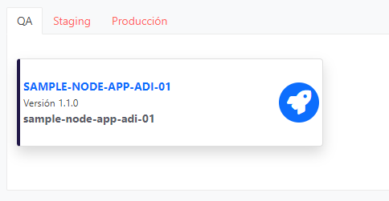
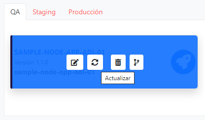
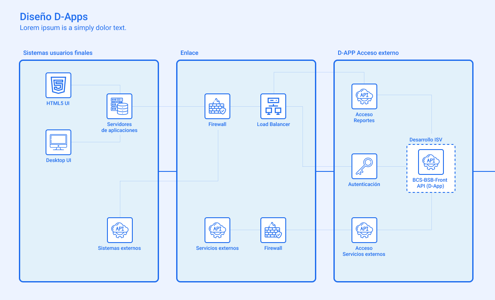

### Conocimientos necesarios

Para que comprendas y hacer uso de manera exitosa se asume que posees las siguientes capacidades y conocimientos:

- **Programación en JavaScript** con el estandar ECMAScript 6 o posterior
- **Programación en TypeScript**
- **Programación de aplicaciones con NodeJs**
- **Programación de APIs** con Loopback 4
- Descargar y usar **Módulos JavaScript via NPM**
- Uso de comandos linux básicos para navegación en los **sistemas de archivos, compresión y descompresión en formato tar.gz.**
- **Programación de tareas en formato crontab**
- Creación de plantillas de **Rerportes con JasperReport**

### Ambiente de Desarrollo

Es necesario que cuentes con un ambiente de desarrollo con las siguientes características:

- Sistema Operativo Linux, se recomienda pero no excluye a otros, usar Ubuntu 20 ya sea virtualizado o instalado en un computador físico.
- Tener instalado NodeJs 14 __Nodejs__ _https://nodejs.org/_
- Tener instalado docker 19.03.13 o superior __Docker__ _https://docs.docker.com/desktop/_
- Acceso a Internet
- Un IDE de Desarrollo, se recomienda Visual Studio Code aunque se pueden usar otros IDE con soporte para programación en NodeJs __Visual Studio__ _https://code.visualstudio.com/_
- Un cliente SSH. Por ejemplo, __Putty__ _https://www.putty.org/_
### Recursos disponibles para desarrollar

AUNA posee recursos disponibles para agilizar el desarrollo de aplicaciones Blockchain las cuales son:

1. Repositorio NPM
2. Repositorio de imágenes Docker

A continuación, se explican mas a fondo los recursos disponibles:

#### 1. Repositorio NPM

Acá es donde está alojado el SDK de AUNA, podrás encontrar diferentes herramientas tales como:

- Conectores para Blockchain
- Smart Contract runtime
- Api Client
- Administración de red Fabric
- Librerías de servicio Mailing
- Librerías de Smart contracts
- Conexiones para interfaces externas
- Task Scheduler
- Realease packager

Para revisar este acceso dirigirse a _https://npm.aunablockchain.com/_.

Todas estas herramientas están explicadas a cabalidad más adelante en una sección especial para el SDK.

#### 2. Repositorio de imágenes

El repositorio de imágenes docker contiene imágenes de utilidad para el desarrollador, las cuales se listan las siguientes imágenes:

- library/nginx
- library/tomcat
- library/mssql
- library/cortex-gateway
- library/wildfly-bcs
- library/busybox
- library/mongo
- library/jenkins-standalone
- library/postgres
- library/adminer

Para revisar este acceso dirigirse a _https://registry.aunablockchain.com/_.

Importante: Para poder descargar las imágenes se necesita que el usuario haga log in en el repositorio de imágenes docker, para ello se debe ejecutar el siguiente comando:

- docker login registry.aunablockchain.com Posterior a ello se deben utilizar las credenciales facilitadas por aunablockchain para finalizar correctamente la descarga.

### Apps de prueba

#### Sample Node App

Descripción

Aplicación de muestra realizada principalmente con Typecript. Incluye:

- Un Smartcontract simple basado en Golang con operaciones CRUD básicas
- Un Smartcontract simple basado en Node.js con operaciones CRUD básicas y recuperación de historial
- Una API Node.js TypeScript interna de que se conecta a la red Fabric para operar con el contrato inteligente
- Una API Node.js TypeScript externa que expone la funcionalidad comercial que se consumirá

Instrucciones

Edite el archivo project.yaml para el atributo network. Cambie el ID de la &quot;organización&quot; (ID de la organización) por su propio valor.

Edite el archivo project.yaml para el atributo **smartcontracts[].endorsement**:

```
smartcontracts:
- id: test-go
  endorsement: '{"identities":[{"role":{"name":"member","mspId":"bcsMSP"}}],"policy":{"signed-by":0}}'
```

Cambie el valor de &quot;mspId&quot; por su propio ID de organización MSP.

Antes de cargar la aplicación de muestra, haga lo siguiente:

```
cd smartcontracts/test-go
go mod vendor
```

Si aún no ha instalado AUNA Packer, haga lo siguiente:

```
npm i -g @bcs/auna-packer --@bcs:registry=https://npm.aunablockchain.com
```

Luego, cree el paquete de la aplicación con:

```
cd ..
cd ..
packer compress -p .
```

Finalmente, cargue el paquete de la aplicación en el portal de ISV de AUNA.

##### Test local APIs

Compruebe que el código fuente de las API sea sintácticamente válido como TypeScript.

Para la API externa, use los siguientes comandos:

```
cd apis/external/sample-external
# Install NPM modules with dev dependencies
npm install --save-dev
# Build the Node.js code from Typescript
npm run build
# Run the API
node .
```

Se ejecutará para siempre, hasta que finalice el proceso con CTRL + C.

Para la API interna, use los siguientes comandos:

```
cd apis/internal/sample-internal
# Install NPM modules with dev dependencies
npm install --save-dev
# Build the Node.js code from Typescript
npm run build
# Run the API
node .
```

La API interna se bloqueará en la etapa de inicialización, ya que requiere un archivo de perfil de conexión de Fabric válido y un archivo de usuario válido.

##### Test local Chaincodes

Compruebe que el código fuente de las API sea sintáctica y semánticamente válido como Golang.

Para el código de cadena **test-go** , use los siguientes comandos:

```
cd smartcontracts/test-go
go build
```

Se creará un archivo ejecutable llamado **test-go** si el código no tiene errores de compilación.

Para el Chaincode **test-node** , use los siguientes comandos:

```
cd smartcontracts/test-node
npm install
npm run start
```

El contrato inteligente de Node.js intentará conectarse a su nodo par y fallará inmediatamente. Cualquier otro error indica un error de sintaxis en el código.

##### Próximos pasos

Verifique el archivo README.md en la carpeta de red

### Asistente de redes y aplicaciones AUNA

AUNA cuenta con un asistente para crear redes blockchain, el cual te permitirá generar un archivo de configuración de la red que funciona de plantilla para la creación de tu app de manera sencilla y rápida. En esta sección revisaremos las diferentes propiedades a configurar dentro del asistente.

#### Definición del nombre del proyecto.

Se debe indicar el nombre del proyecto, el cual debe tener al menos 4 caracteres y no debe haber sido utilizado anteriormente.

#### Definición del tipo de proyecto.

Se debe indicar el tipo de proyecto, el cual puede ser creado desde cero, o en base a algún proyecto creado con anterioridad.

#### Definición del tipo de red.

Se debe indicar el tipo de red, la cual puede ser creada desde cero, o se puede unir a una red ya existente.

#### Definición del nombre de la red.

Se debe indicar el nombre de la red.

#### Definición de la organización.

Las organizaciones son aquellas empresas o individuos que pertenecen a la red y tienen algún grado de responsabilidad sobre la misma. Un grupo de organizaciones puede formar un consorcio.
 Se debe indicar la organización que define la nueva red que se está configurando.

#### Definición del tipo de red.

La red tipo AUNA es una red de negocios respaldada por la Bolsa de Santiago, el Depósito Central de Valores y GTD Teleductos.

 Importante: Por ahora solo está disponible la red AUNA

#### Definición del protocolo que utilizará la red.

Se debe indicar el protocolo blockchain con el cuál operará la red que se está creando.

Importante: Por ahora solo está disponible Hyperledger Fabric 2.0

#### Definición del Sistema de ordenamiento que utilizará la red.

El sistema de ordenamiento o algoritmo de consenso es el encargado de validar que las transacciones sean válidas para propagarlas por la red.

 Se debe indicar el Sistema de ordenamiento que va a utilizar la red.

#### Definición de los nodos ordering de la organización.

Los nodos orderer se encargan de mantener la consistencia entre los diferentes nodos de la red, asegurando el orden de las transacciones y ejecutando el mecanismo de consenso.

 Se debe indicar las características de los nodos ordering para la organización.

#### Definición de los nodos peer de la organización.

Cada nodo peer mantiene su propia copia del ledger de manera sincronizada

 Se debe indicar las características de los nodos peer para la organización, de igual forma se pueden agregar nodos para otra organización si se necesita, para ello puede pinchar en el botón  **Agregar Nodo**  o  **Eliminar nodo**  según sea necesario.

#### Definición de características del canal de la red blockchain.

Un canal es una capa de la blockchain privada que permite la confidencialidad de los datos.

Se debe indicar el nombre del canal para la red blockchain que se está creando.

#### Definición del nombre de la aplicación.

Se debe indicar el nombre de la aplicación blockchain que se está creando.

#### Definición de las tareas programadas.

Si se requiere agregar tareas programadas, se pueden agregar n tareas mediante el botón  **Agregar tarea**

#### Fuentes de datos.

Una fuente de datos aplicativa se puede consultar de forma directa, para que AUNA almacene los datos.
 Si se requiere agregar fuentes de datos aplicativas, se pueden agregar múltiples fuentes de datos mediante el botón  **Agregar Datasource**

#### Apis internas.

Apis sin salida al exterior y que interactúan con la red AUNA
 Si se requiere agregar apis internas, se pueden agregar n apis internas mediante el botón  **Agregar Api interna**

#### Apis externas.

Apis con salida al exterior pero que no interactúan con la red AUNA a través de las apis internas.
 Si se requiere agregar apis externas, se pueden agregar n apis externas mediante el botón  **Agregar Api Externa**

#### Apis hibridas.

Apis que cumplen la función de ser externas e internas a la vez, tienen salida al exterior y pueden interactuar con la red AUNA.
 Si se requiere agregar apis hibridas, tanto internas como externas, se pueden agregar n apis hibridas mediante el botón  **Agregar Api Hibrida**

#### Permisos Dapp

Permisos de acceso que permiten a la Dapp interactuar con servicios externos que la empresa disponga.
 Puedes agregar n permisos para la Dapp con n host para cada permiso.

#### Resumen

En esta sección puede  **ver el resumen de las configuraciones realizadas** , información y características seleccionadas en las diferentes etapas del asistente de redes y aplicaciones

**Puede descargar el archivo con el detalle de las configuraciones para utilizarlo como plantilla básica de desarrollo**.

### Desarrollo de App

A continuación, se describen la estructura que debe tener una app para su correcto funcionamiento y los artefactos de desarrollo que se pueden implementar en ella.

#### Estructura de app

Diremos que la carpeta inicial de una app es su carpeta raíz, dentro de la carpeta raíz se debe tener la siguiente estructura:

- CarpetaRaíz
    - yaml
    - apis
        - internal
            - api-internal
        - external
            - api-external
    - smartcontracts
    - md

A continuación, se describe cada una de las carpetas de la estructura:

- CarpetaRaíz/ **project.yaml** : Este archivo corresponde al archivo que configura la App.

- CarpetaRaíz/apis/internal/ **api- internal** : En esta ruta debes colocar el código de tu api interna.

- CarpetaRaíz/apis/external/ **api- external** : En esta ruta debes colocar el código de tu api externa.

- CarpetaRaíz/ **smartcontracts** : En esta carpeta se alojarán archivos relacionados a los SmartContracts

- CarpetaRaíz/README.md: Archivo de documentación propio de la App

#### Creando plantilla App con Asistente AUNA

En la siguiente sección te encontrarás con el paso a paso de la construcción de una Dapp.

## Wizard creacion de red y aplicación

Te ofrecemos un wizard que te ayudará a configurar los componentes de tu app, desde el tipo de red hasta creacion de aplicacion con sus respectivos componenetes (apis, permisos externos, etc). Al finalizar el wizard obtendrás un archivo YAML con todo lo necesario para generar tu app y deployar en AUNA. 

Para acceder a él debes hacer click en el menú  **&quot;Construir Aplicaciones / Asistente de Redes y Aplicaciones&quot;**.

### Configuracion de red

#### Ejemplo para red Fabric

Elegir que tipo de protocolo quieres para tu red,

  

¿Cómo se llamará la nueva red?

  - Escribe “sample-network”

  

Organización
  - se asigna por defecto al ISV, en nuestro caso, "bcs" 

  

Actualmente se cuenta con el sistema de ordenamiento RAFT

  

Nodos ordering: Responsables de la distribución de los bloques.

    - Por defecto se recomiendan 3 nodos de tipo ordering y se debe especificar quien es el dueño de los nodos.
    Se asigna por defecto al isv como dueño de los nodos

        -	Cantidad de nodos Ordering: 3
        -	Organización a la cual pertenecerán los nodos Ordering: bcs-ordering

  

Nodos peers: Mantienen los datos del ledger sincronizados en la red.

    - Por defecto se recomiendan mínimo 2 nodos de tipo peer y se debe especificar quien es el dueño de los nodos.

        -	Cantidad de nodos peer: 2
        -	Organización a la cual pertenecen los nodos peer: bcs

  


El canal es una capa de la blockchain privada que permite la confidencialidad de los datos.

    - Escribe un nombre para tu canal, por ejemplo "my-channel"

  


#### Ejemplo para red Besu

Para esta parte del wizard, nos saltaremos las configuraciones generales y saltaremos directo a las configuraciones para la red Besu

Actualmente para las redes besu se cuenta con el algoritmo de consenso "IBFT 2.0"

  

Para el caso de los nodos validadores, IBFT 2.0 requiere de minimo cuatro validadores para ser tolerantes a fallas bizantinas. La tolerancia a fallas bizantina es la capacidad de una red blockchain para funcionar correctamente y llegar a un consenso a pesar de que los nodos fallan o propagan información incorrecta a sus pares.

  

Tipo de smartcontracts para la red Besu, solo disponible en lenguaje solidity.
  
  


###  Configuracion de Aplicacion

  Nombre para tu app

  

  Tareas programadas para la app

    - Nombre: sample-task
    - Comando: curl --fail -X POST --header &#39;Content-Type: application/json&#39; --header &#39;Accept: application/json&#39; -d &#39;{}&#39; &#39;http://sample-interal:4001/sample-task&#39;
    - Categoría: Mejora en procesos
    - Cron: 30 18 \* \* 1-5
    - Descripción: Example process that runs at 18:30 every week day Monday to Friday

  

Fuente de datos aplicativa

  - se puede consultar una de forma directa, para que AUNA almacene los datos. Si se requiere agregar fuentes de datos aplicativas, se pueden agregar múltiples fuentes de datos

  

Apis Internas

  - Apis sin salida al exterior y que interactuan con la red AUNA

      - Nombre: sample-internal
      - Protocolo: HTTP
      - Puerto: 4001
      - Host: some.host
      - Path: apis/internal/sample-internal
      - Descripción: Internal Api example
      - Singleton: Activo
      - Runtime:
        1. Image: &quot;&quot;
        2. Type: Node
        3. Version: 14

  

Apis Externas

  - Apis con salida al exterior pero que no interactuan con la red AUNA a través de las apis internas.

    - Nombre: sample-external
    - Protocolo: HTTP
    - Puerto: 4000
    - Host: some.host
    - Path: apis/external/sample-external
    - Descripción: External Api example
    - Singleton: Activo
    - Runtime:
      1. Image: &quot;&quot;
      2. Type: Node
      3. Version: 14

  

Apis hibridas

  - Apis que cumplen la funcion de ser externas e internas a la vez, tienen salida al exterior y pueden interactuar con la red AUNA

  

Permisos Dapp

  - Permisos de acceso que permiten a la App interactuar con servicios externos que el isv disponga.

  

Resumen

- Información y características seleccionadas en las diferentes etapas del asistente de redes y aplicaciones
  
- Presiona &quot;Guardar&quot; para obtener la configuración del proyecto en formato YAML.&quot;.

    


### Generar estructura de carpetas para la App

Para generar una estructura de carpetas que sirva como maqueta se necesita descargar el archivo con el detalle de las configuraciones generado en el Wizard o en su defecto, el creado por el usuario.

**Instrucciones de instalación de herramientas necesarias y generacion de estructura:**

1. Instalar Node.js

2. Instalar Yeoman: 

```
npm install -g yo
```

3. Definir scope para @auna: 

```
npm config set @auna:registry https://npm.aunablockchain.com
```

4. Instalar Generador AUNA SDK: 

```
npm install -g @auna/generator-auna-sdk-cli
```

5. Crear un directorio de trabajo y copiar allí el archivo project.yaml generado

6. Crear proyecto: 

```
yo @auna/auna-sdk-cli ./project.yaml
```


#### Empaquetado de app

Para poder subir una app a AUNA esta debe ser comprimida en formato **tar.gz** y para esto AUNA dispone de una herramienta de compresión en el SDK de nombre PACKER en caso de que no se quiera hacer de forma manual.

Packer lo que hace es validar la estructura de la app y el Project.yaml de la app, si todo esto está en orden, el packer comprime la app con formato tar.gz.

Packer es parte del SDK de AUNA, herramienta explicada mas adelante en una sección especial para el SDK.

#### Subir App

Con tu aplicación ya creada ingresa a &quot;Subir aplicaciones&quot; en el portal AUNA e ingresa los siguientes datos:

1. Nombre de la App: &quot;sample-node-app&quot;
2. Descripción: Aplicación de Ejemplo
3. Categoría: Seleccionar una disponible.
4. Selecciona la infraestructura para tu App
5. Seleccionar en tu computadora la app comprimida en formato tar.gz.

 Importante: Se espera como nombre de App el mismo nombre ingresado en el project.yaml de la aplicación.
#### Revisa el estado de la app

Ingresa a &quot;Mis aplicaciones&quot; y selecciona &quot;En progreso&quot;, ahí encontrarás una lista con las apps que se hayan subido al sistema AUNA con el detalle del proceso actual en el que se encuentra la aplicación, nos muestra el nombre de la app y su fecha de ingreso (subida).

Al seleccionar una app de la lista, se muestra en que estado del pipeline de liberación se encuentra, al mismo tiempo, se muestran dos opciones más al usuario, &quot;Ver logs&quot; y &quot;Anular&quot;.

##### Ver Logs

En caso de que el deploy de la app haya tenido dificultades para terminar, acá se puede obtener información de que falló al momento del deploy.

##### Anular

Anular el deploy de la app en el ambiente al cual esta intentando acceder, se debe indicar el motivo de la cancelación.

##### Actualizar app

Ingresa a &quot;Mis aplicaciones&quot; y selecciona &quot;Mis Apps&quot;, ahí encontrarás una lista con las apps que se hayan subido al sistema AUNA.




Pasar el puntero por encima de la app que requiere actualizacion y precionar el boton actualizar (segundo boton de izquierda a derecha).



Puedes actualizar la descripcion de la app, cambiar su categoria y subir una nueva version de tu app.


#### Ejemplo App utilizando SDK

Aquí encontrarás un recorrido paso a paso de cómo se implementa una Dapp de préstamos de Instrumentos Bursátiles que interactúa con la Blockchain para solicitar, aprobar y liquidar estas operaciones. Como funcionalidad adicional también se podrán consultar y obtener reportes en formato PDF de los prestamos bursátiles.

Al finalizar este recorrido no sólo habrás creado una Dapp sino que también la habrás publicado en el ambiente de certificación de Dapps.

A continuación, te dejamos el link al repositorio de la app de prueba:

- Ir a su repositorio _https://github.com/AunaBlockchain/auna-sample-apps/tree/main/typescript/primera-d-app_

##### Diagrama de diseño de una Dapp

El siguiente diagrama sirve para ayudar a conceptualizar la comunicación de una Dapp con el sistema y con el ambiente externo:

__D-APP acceso interno__

  

__D-APP acceso externo__

  

##### App de ejemplo con SmartContracts

También se cuenta con una app con smartcontracts de ejemplosimple en la que solo se incluye la creación de red y app.

A continuación, te dejamos el link al repositorio de la app de prueba:

- Ir a su repositorio _https://github.com/AunaBlockchain/auna-sample-apps/tree/main/typescript/sample-node-app_

##### Apis de acceso de App

###### Creación de la API Externa

Las APIs REST pueden desarrollarse en Java, Golang, JavaScript y/o TypeScript. En este recorrido usaremos Loobackp 4 (LB4) para desarrollar una API Rest.

Para crear la API externa utilizaremos las herramientas que ofrece LB4, sigue las siguientes instrucciones:

1. Crea la carpeta para las APIs externas:

  - _mkdir -p carpetaRaiz/apis/external_

2. Posiciona la terminal en la carpeta recién creada.

  - _cd carpetaRaiz/apis/external_

3. Si no tiene instalado LB4, puede hacerlo con el siguiente comando:

  - _npm i -g @loopback/cli_

4. Creación e la API por medio de:

  - _lb4 app_

5. Responda las preguntas del siguiente modo:

  - Project name: api-ext
  - Project description: External API
  - Project root directory: (api-ext)
  - Application class name: (ApiIntApplication)
  - Select features to enable in the project (seleccionar todo)

6. Presione  **Enter**  y espere que se instalen las dependencias.

7. La API externa estará ubicada en _carpetaRaiz/apis/external/api-ext_

8. La API externa se expondrá, y para acceder a su endpoint se debe utilizar el siguiente patrón:

  - ID\_APLICACION-NOMBRE\_APLICACION.aunablockchain.com/

###### Creación de la API Interna

Las APIs REST pueden desarrollarse en Java, Golang, JavaScript y/o TypeScript. En este recorrido usaremos Loobackp 4 (LB4) para desarrollar una API Rest.

Para crear la API interna utilizaremos las herramientas que ofrece LB4, sigue las siguientes instrucciones:

1. Crea la carpeta para las APIs internas:

    • mkdir -p _carpetaRaiz_/apis/internal

2. Posiciona la terminal en la carpeta recién creada.

    • cd _carpetaRaiz_/apis/internal

3. Si no tiene instalado LB4, puede hacerlo con el siguiente comando:

    • npm i -g @loopback/cli

4. Creación e la API por medio de :

    • lb4 app

5. Responda las preguntas del siguiente modo:

    • Project name: api-int

    • Project description: Internal API

    • Project root directory: (api-int)

    • Application class name: (ApiIntApplication)

    • Select features to enable in the project (seleccionar todo)

6. Presione Enter y espere que se instalen las dependencias.

7. La API interna estará ubicada en _carpetaRaiz_/apis/internal/api-int

##### Instalación de Librerías AUNA SDK en Apis

###### Instalación de librerías del SDK en API Interna

1. En la raíz de la API Interna agregar al archivo **.npmrc** una línea con el siguiente contenido:

    @bcs:registry=https://npm.aunablockchain.com/.

    Se debe renombrar el archivo a  **.npmrc**.
    (_https://github.com/AunaBlockchain/auna-sample-apps/blob/71a7d15b06c09a4eada2a4796d4c0788f9e88a63/typescript/primera-d-app/apis/external/api-ext/.npmrc_)

2. Luego ejecutar los siguientes comandos:

    - _cd carpetaRaiz/apis/internal/api-int_
    - _npm i @bcs/baas-report-cli_
    - _npm i @bcs/auna-report-template-cli_
    - _npm i @bcs/baas-mailer-cli_
    - _npm i @bcs/auna-mailer-template-cli_
    - _npm i convert-string_

###### Instalación de librerías del SDK en API Externa

1. En la raíz de la API Externa agregar al archivo **.npmrc** una línea con el siguiente contenido:

    @bcs:registry=https://npm.aunablockchain.com/

    Se debe renombrar el archivo a  **.npmrc**.
    (_https://github.com/AunaBlockchain/auna-sample-apps/blob/71a7d15b06c09a4eada2a4796d4c0788f9e88a63/typescript/primera-d-app/apis/external/api-ext/.npmrc_) 

2. Luego ejecutar los siguientes comandos:

    - _cd carpetaRaiz/apis/external/api-ext_
    - _npm i @bcs/baas-report-cli_
    - _npm i @bcs/auna-report-template-cli_
    - _npm i @bcs/baas-mailer-cli_
    - _npm i @bcs/auna-mailer-template-cli_
    - _npm i convert-string_

##### Configuración de Puertos de Apis

###### Configurando el puerto en la Api Interna

Debe modificar la función _main_ en el archivo _carpetaRaiz/apis/internal/api-int/src/index.ts_, del siguiente modo:

```
export async function main(options: ApplicationConfig = {}) {
options.rest = {
port: +( process.env.API\_PORT || &quot;4002&quot;),
requestBodyParser: {json: {limit: &#39;100mb&#39;}}
};
const app = new ApiIntApplication(options);
await app.boot();
await app.start();
const url = app.restServer.url;
console.log(`Server is running at ${url}`);
console.log(`Try ${url}/ping`);
return app;
}
```

###### Configurando el puerto en la Api Externa

Debe modificar la función main en el archivo _carpetaRaiz/_apis/external/api-ext/src/index.ts, del siguiente modo:

```
export async function main(options: ApplicationConfig = {}) {
options.rest = {
port: +( process.env.API\_PORT || &quot;4001&quot;),
requestBodyParser: {json: {limit: &#39;100mb&#39;}}
};
const app = new ApiExtApplication(options);
await app.boot();
await app.start();
const url = app.restServer.url;
console.log(`Server is running at ${url}`);
console.log(`Try ${url}/ping`);
return app;
}
```

##### Apis mediante imágenes Docker

Es posible configurar la creación de la imagen docker de las APIs mediante un archivo Dockerfile situado en la raíz de cada API.

Puedes usar el siguiente **Dockerfile** como guía, recuerda exponer el puerto correspondiente a la API Interna o Externa según corresponda.

  (_https://github.com/AunaBlockchain/auna-sample-apps/blob/0f68bb47d11565b67e0a7a9b8429a851a31a4199/typescript/primera-d-app/apis/internal/api-int/Dockerfile_)

##### Utilizando librerías descargadas

###### Reportes

AUNA ofrece un servicio de reportería que permite consultar datos a la Blockchain y descargarlos en formato PDF y que instalamos en los pasos anteriores.

A continuación, te mostramos como crear una plantilla de reporte y consultar reportes:

_Plantillas de Reportes_

Para dar formato al reporte se deben utilizar plantillas de JasperReport Collateral.jrxml

  (_https://github.com/AunaBlockchain/auna-sample-apps/blob/71a7d15b06c09a4eada2a4796d4c0788f9e88a63/typescript/primera-d-app/apis/internal/api-int/src/report/Collateral.jrxml_)

Sigue los siguientes pasos para crear tu plantilla de reporte:

1. Crea el archivo de la plantilla en la siguiente ruta:
    - carpetaRaiz/apis/internal/api-int/src/report/Collateral.jrxml

_Consultar Reportes_

Para consultar reportes debes seguir los siguientes pasos:

1. Crea el archivo cliente para consultar el reporte en la siguiente ruta client-report.ts

  (_https://github.com/AunaBlockchain/auna-sample-apps/blob/71a7d15b06c09a4eada2a4796d4c0788f9e88a63/typescript/primera-d-app/apis/internal/api-int/src/report/client-report.ts_)

    \* _mkdir - carpetaRaiz/apis/internal/api-int/src/report/_

    \* _carpetaRaiz/apis/internal/api-int/src/report/client-report.ts_

2. Crear interface de reportes interface-report-repository.ts

  (_https://github.com/AunaBlockchain/auna-sample-apps/blob/71a7d15b06c09a4eada2a4796d4c0788f9e88a63/typescript/primera-d-app/apis/internal/api-int/src/controllers/interface-report-repository.ts_)

    \* _carpetaRaiz/apis/internal/api-int/src/controller/interface-report-repository.ts_

3. Crear controlador de reportes report.controller.ts

  (_https://github.com/AunaBlockchain/auna-sample-apps/blob/71a7d15b06c09a4eada2a4796d4c0788f9e88a63/typescript/primera-d-app/apis/internal/api-int/src/controllers/report.controller.ts_)

    \* _carpetaRaiz/apis/internal/api-int/src/controller/report.controller.ts_

###### Servicio de Mails

1. Crea el archivo cliente mails client-mail.ts

  (_https://github.com/AunaBlockchain/auna-sample-apps/blob/71a7d15b06c09a4eada2a4796d4c0788f9e88a63/typescript/primera-d-app/apis/internal/api-int/src/mail/client-mail.ts_)

    \* mkdir -p _carpetaRaiz/_apis/internal/api-int/src/mail/

    \*  carpetaRaiz/apis/internal/api-int/src/mail/client-mail.ts\*

2. Crear interface de mails interface-mail-repository.ts

  (_https://github.com/AunaBlockchain/auna-sample-apps/blob/71a7d15b06c09a4eada2a4796d4c0788f9e88a63/typescript/primera-d-app/apis/internal/api-int/src/controllers/interface-mail-repository.ts_)

    \* _carpetaRaiz/apis/internal/api-int/src/controller/interface-mail-repository.ts_

3. Crear controlador de mails mail.controller.ts

  (_https://github.com/AunaBlockchain/auna-sample-apps/blob/71a7d15b06c09a4eada2a4796d4c0788f9e88a63/typescript/primera-d-app/apis/internal/api-int/src/controllers/mail.controller.ts_)

    \* _carpetaRaiz/apis/internal/api-int/src/controller/mail.controller.ts_

##### Archivo de Configuración App

La Dapp debe ser configurada por medio de un archivo en proyect.yaml.

  (_https://github.com/AunaBlockchain/auna-sample-apps/blob/71a7d15b06c09a4eada2a4796d4c0788f9e88a63/typescript/primera-d-app/project.yaml_)

Para la generación de este archivo se puede ayudar con la herramienta de configuración de la red Blockchain o también puede ser creado manualmente.

El archivo de configuración project.yaml debe quedar en la siguiente ubicación:

- carpetaRaiz/_project.yaml_

```
# Application section
application:
  # Unique DApp ID
  id: sample-node-app-test1
  # DApp name under RFC 1123 Standard (https://tools.ietf.org/html/rfc1123). The name must:
  # - contain at most 63 characters
  # - contain only lowercase alphanumeric characters or '-'
  # - start with an alphanumeric character
  # - end with an alphanumeric character
  name: sample-node-app-test1
  # DApp description, max 100 characters
  description: AunaBlockchain Node.js sample DApp
  # DApp category, max 30 characters
  category: examples
# Blockchain Network section
network: 
  # Unique network ID
  id: sample-network
  # Network name under RFC 1123 Standard
  name: sample-network
  # Fabric Version
  version: "2.0.0"
  # Action, for future manteinance use
  action: "exists"
  # Orderers nodes subsection
  orderers:
    # Quantity of orderer nodes, positive integer
  - nodes: 3
    # Orderer organization id (RFC 1123)
    org: bcs-ordering
    # Consensus algorithm, for Fabric v2 can only be "etcdraft"
    consensus: etcdraft
  # Fabric Channels subsection, a list of one or more channels
  channels:
    # Channel name (RFC 1123)
  - channel: my-channel
    # Participating organization list for the channel. Array of organization IDs
    orgs:
    - bcs
  # Participating organizations subsection. List of organizations
  organizations:
    # Organization ID
  - id: bcs
    # Hosted, for future usage. Defaults true
    hosted: true
  # Peer nodes subsection. List of Peer nodes
  peers:
    # Quantity of peer nodes, positive integer
  - nodes: 2
    # Owner organization of the peer nodes
    org: bcs
  # Chaincodes subsections. Indicates which Smartcontract is installed in a specific Channel for a list of participating Organizations.
  # The same Smartcontract can be installed in more than one Channel (repeating the configuration)
  chaincodes:
    # Smartcontract ID (see "smartcontracts" section)
  - smartcontract: test-go
    # Channel ID (see "channels" subsection)
    channel: my-channel
    # Participating organization that will install the Smartcontract (see "organizations" and "peers" subsections)
    orgs:
    - bcs
  - smartcontract: test-node
    channel: my-channel
    orgs:
    - bcs
# Smartcontracts section. Smartcontracts are managed as independent software components that can be instantiated multiple times in the blockchain network
smartcontracts:
  # Smartcontract ID (RFC 1123)
- id: test-go
  # Endorsement policy in JSON format. For examples, see: https://hyperledger.github.io/fabric-sdk-node/release-1.4/global.html#ChaincodeInstantiateUpgradeRequest__anchor
  endorsement: '{"identities":[{"role":{"name":"member","mspId":"bcsMSP"}}],"policy":{"signed-by":0}}' #en el objeto roles, campo mspId, cambiar "bcs" por identificador de isv, ejemplo: "mspId":"bcsMSP"
  # Metadata Path. If the Smartcontracts defines query indexes, this is the relative path (see "path" attribute) for the metadata folder
  metadapath:
  # Version number in semver (semantic versioning) format
  version: v1.0.0
  # Relative path for the Smartcontract sourcecode
  path: smartcontracts/test-go
  # Runtime type. Values can be: golang, node (java not yet supported)
  type: golang
- id: test-node
  endorsement: '{"identities":[{"role":{"name":"member","mspId":"bcsMSP"}}],"policy":{"signed-by":0}}' #en el objeto roles, campo mspId, cambiar "bcs" por identificador de isv, ejemplo: "mspId":"bcsMSP"
  metadapath:
  version: v1.0.0
  path: smartcontracts/test-node
  type: node
# API section. Here you define your stateless API components
api:
  # Interal APIs subsection. Internal APIs can access the blockchain network but are not externally accesibles
  internal:
      # API name (RFC 1123)
    - name: "sample-internal-01"
      protocol: "HTTP"
      # Exposed port (internal communitation with other API components)
      port: "4001"
      # Exposed host (internal communitation with other API components, use 0.0.0.0 to listen to all IPs)
      host: "0.0.0.0"
      # Optional: sourcecode path. If not defined, the "runtime.image" must not be empty
      path: "apis/internal/sample-internal"
      # API description
      description: "Internal Api example"
      # Runtime subsection
      runtime:
        # Optional: Docker image full qualified name. If empty, the sourcecode path must have a valid value
        image: ""
        # Optional: runtime type, if sourcecode is used
        type: "node-ts"
        # Optional: runtime version, if sourcecode is used
        version: "14"
      # Environment variables
      env:
        - name: "SOME_VAR"
          value: "someValue"
      report: {}
      tasks: []
      cache: []
      mailer: {}
      # Prometheus metrics scrapping
      metrics:
        # Enable (true) / disable (false) custom metrics recollection
        enabled: true
        # TCP port for metrics scrapping
        port: 8000
        # Optional. HTTP endpoint for metrics scrapping (defaults to "/metrics")
        endpoint: "/metrics"
      # API is deployed in singleton mode (true) or not (false, default)
      singleton: true
      permissions: []
  external:
    - name: "sample-external-01"
      protocol: "HTTP"
      port: "4000"
      host: "0.0.0.0"
      path: "/apis/external/sample-external"
      description: "External Api example"
      runtime:
        image: ""
        type: "node-ts"
        version: "14"
      env:
        - name: "SOME_OTHER_VAR"
          value: "anotherValue"
      report: {}
      tasks: []
      cache: []
      mailer: {}
      metrics:
        enabled: true
        port: 8000
        endpoint: "/metrics"
      singleton: true
      permissions: []
  both: []
# Fabric cache section
cache : []
# Tasks section. Used to define automated tasks to execute for the DApp
tasks:
    # Task ID (RFC 1123)
  - tasktag: "sample-task"
    # Task category
    category: "examples"
    # Task description
    description: "Example process that runs at 18:30 every week day Monday to Friday"
    # Cron-format schedule for execution
    cron: "30 18 * * 1-5"
    # Task command
    task: "curl --fail -X POST --header 'Content-Type: application/json' --header 'Accept: application/json' -d '{\"message\":\"hello\"}' 'http://sample-interal:4001/echo'"
# Internal persistent Datasource section. Used to define persistent databases for internal consumption
datasource: []
env: []
# External access permission section
permissions: []
```