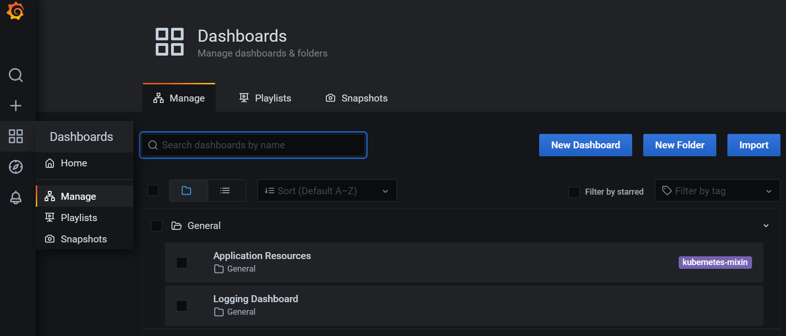

### Grafana

Grafana entrega un set de dashboards que pueden ser importados para visualizar mértricas y logs de las aplicaciones desarrolladas con AUNA.

    https://grafana.com/grafana/dashboards/

### Portal AUNA

Auna proporciona la interfaz web necesaria para visualizar y gestionar los dashboards de Grafana:

    https://grafana.aunablockchain.com/grafana/

### AUNA Dashboards 

Auna entrega dos dashboards listos para ser usados por nuestros usuarios. Se pueden ver en la sección Dashborads -> Manage

 

### Application Resource

Muestra métricas del uso de componentes de Hardware de una Dapp

### Logging Dashboard

Muestra logs de la Dapp seleccionada

