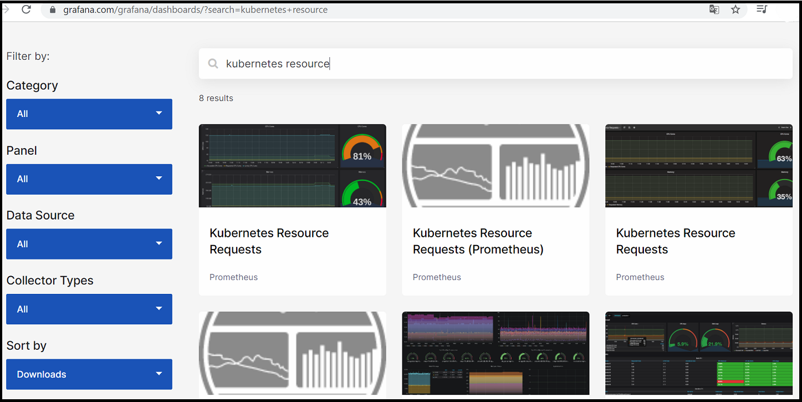
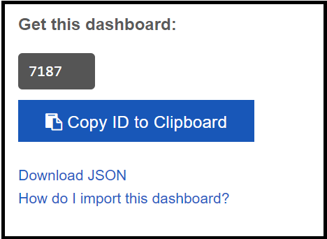
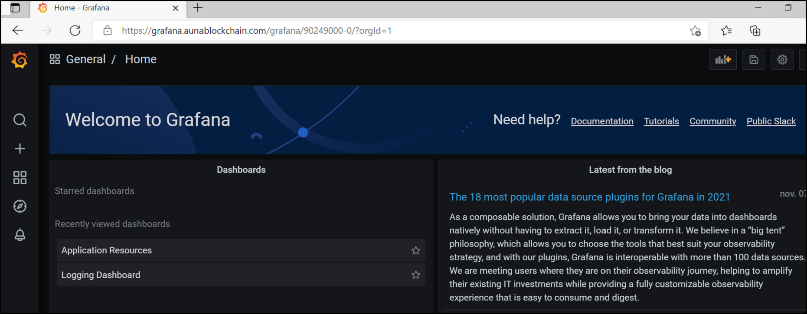
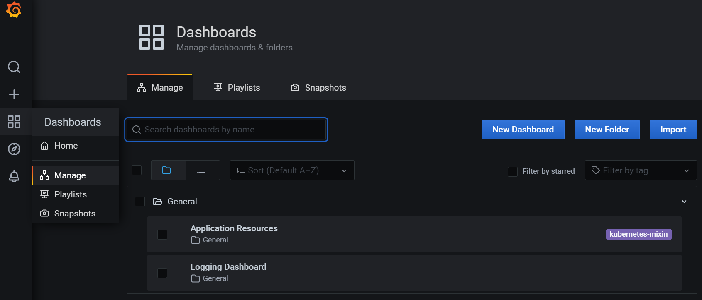
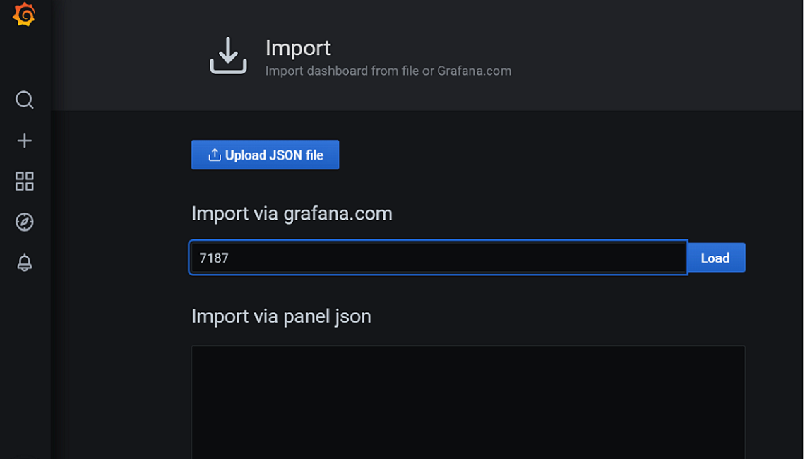
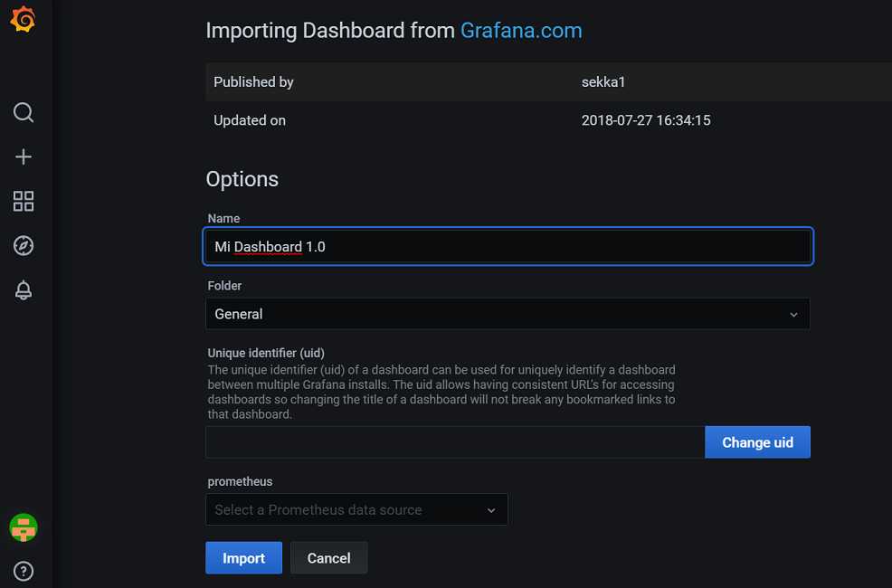
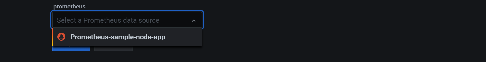
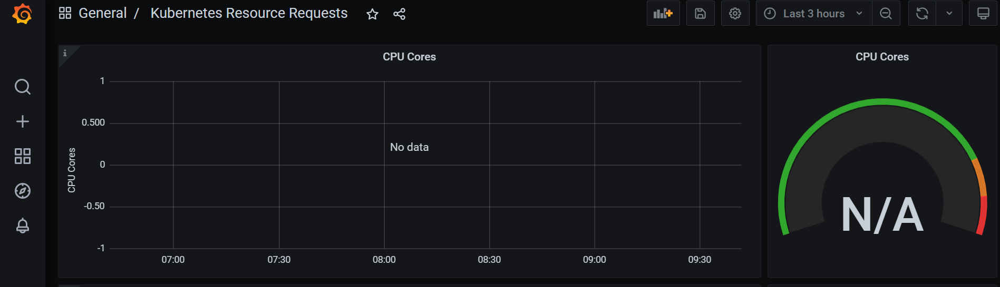

### Importar un Dashboard

Para importar un dashboard sigue los siguientes pasos:

1.	Seleccionar dashboard desde: https://grafana.com/grafana/dashboards/
     - Se puede realizar una busqueda por el nombre del dashboard o usando el panel de filtros.

    

2.	Copiar el ID del dahsborad o descargar en formato JSON.

    

3.	Ingresar a:
    https://grafana.aunablockchain.com/grafana/

    

4.	Selecccionar opción Manage, luego import.

    

5.	Importar. Pegar ID del dashboard o subir JSON file. Luego presionar Load.

    

6.	Dar nombre al dashboard, cambiar UID de ser necesario.

    

7.	Seleccionar Data Source. Se debe seleccionar el data source correspondiente a la aplicación que se desaea monitorear

    

8.	Configurar Dashboard.

    

